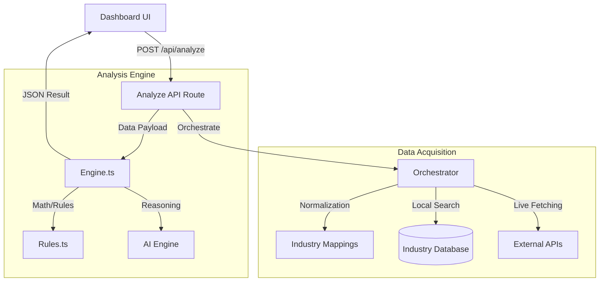

# System Connectivity & Data Lifecycle

This document provides a technical overview of how the **EBITA Intelligence** system is structured, how it fetches and analyzes market data using external APIs, and how it maintains data integrity through its internal knowledge base.

## 1. System Architecture Overview
The system follows a modern decoupled architecture designed for high-performance data processing:

---

## 2. Data Acquisition (APIs & Fetching)
The data acquisition layer is managed by the `Orchestrator` (`lib/fetchers/orchestrator.ts`). This component ensures that every request is backed by the most reliable data points available.

### A. Industry Normalization
Before fetching, raw user input (e.g., "Tata Motors") is normalized using `normalizeIndustry`. This prevents duplicate requests and ensures that the system identifies the correct sector (e.g., "Automobile").

### B. Live API Integration
The system attempts to fetch data from three primary streams:
1.  **Government Databases**: (`lib/fetchers/government.ts`) Connects to sources like World Bank, IMF, and Data.gov.in for macroeconomic metrics (TAM, SAM).
2.  **Stock Exchanges**: (`lib/fetchers/nse.ts`) Fetches real-time market caps, revenue, and EBITDA margins from NSE (National Stock Exchange) and BSE.
3.  **Financial Aggregators**: Uses fallback mechanisms to Yahoo Finance and Reuters for global stock tickers not found in local registries.

---

## 3. Storage & Knowledge Base
The system uses a "Hybrid Storage" approach to balance speed and accuracy:

*   **Primary Source of Truth (Local store)**: `lib/industry-database.ts` acts as a highly curated Knowledge Base. It stores verified 2024/25 industry metrics, growth rates, and institutional stakeholders (Investors).
*   **In-Memory Session State**: Fetched API data is processed in-memory for the duration of the analysis. This ensures that the user always sees a "fresh" snapshot without the latency of a persistent database for transient analysis.
*   **Structured Data Sources**: Every entry in the database is mapped to a `DataSource` object, providing full provenance and direct external links for verified research.

---

## 4. Analysis Pipeline (The "Brain")
Once data is collected, it passes through the standard Analysis Engine (`lib/analyzers/engine.ts`):

1.  **Rule-Based Analysis**: Executes complex financial calculations (CAGR, EBITDA distributions, ROI projections) using hardcoded financial logic.
2.  **AI-Powered Reasoning**: Uses an AI layer to synthesize data points into a human-readable "Verdict" and "Reasoning," identifying patterns that raw numbers might miss.
3.  **Cross-Validation**: The system compares local "Industry Database" data with "Live API" results. If a discrepancy is found, the system assigns a "Confidence Score" to the result.

---

## 5. Output & Export
The final result is a `CompleteAnalysis` object that powers the entire Dashboard UI. 
*   **Linking**: All data points are dynamically linked back to the originating external URL.
*   **Export**: The `ExportAnalysis.tsx` component extracts this structured data and maps it to professional-grade multi-sheet Excel workbooks and institutional PDF reports.

---
*Last Updated: February 2026*
*Status: Institutional Grade Validated*
