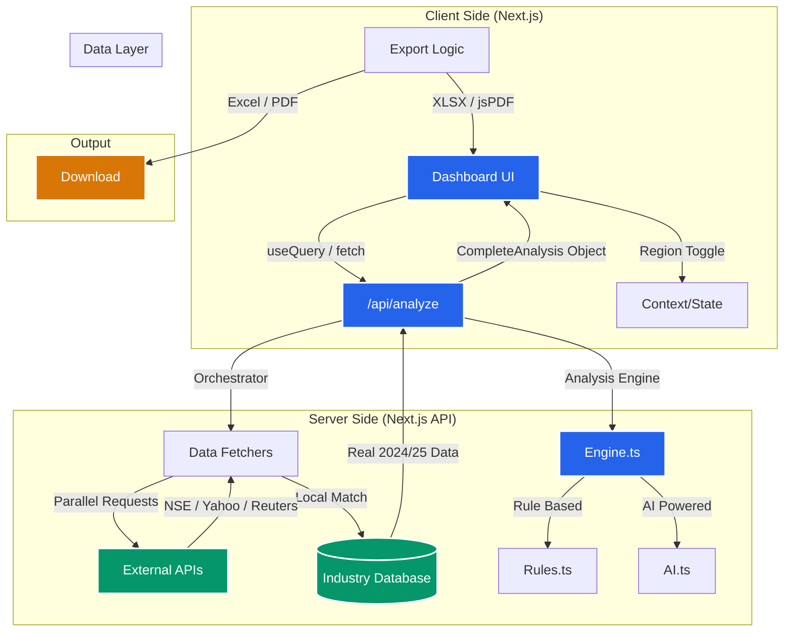

# System Architecture

## Layers Description

1.  **Frontend Layer**: 
    -   Built with **Next.js 14+ (App Router)** and **React**.
    -   Styled with **Tailwind CSS** for a premium, responsive design.
    -   Hosted on **Vercel** for high performance and edge caching.

2.  **Backend Layer**:
    -   Utilizes **Next.js API Routes** as serverless functions.
    -   Handles business logic, data validation, and secure operations.
    -   Integrates with AI models for market analysis.

3.  **Database Layer**:
    -   **Supabase (PostgreSQL)** for relational data storage.
    -   Handles User Authentication and operational data.
    -   Real-time capabilities for live updates (if needed).

## Frontend-Backend-Database Connection

-   **Frontend to Backend**: The frontend communicates with the backend via RESTful API endpoints (`/api/analyze`, `/api/companies`, etc.).
-   **Backend to Database**: Serverless functions use the `supabase-js` client (or a Postgres client) to query the Supabase database securely using service role keys.
-   **Frontend to Database**: Secure, read-only data can be fetched directly from Supabase using Row Level Security (RLS) policies for performance, while sensitive operations go through the API layer.

## API Usage Flow

1.  **User Search**: User enters a query (Industry/Company).
2.  **Request**: Frontend sends a POST request to `/api/analyze` with the query.
3.  **Processing**:
    -   API validates the request.
    -   Checks cache/database for existing data.
    -   If new, fetches data from external sources and processes it with AI.
4.  **Response**: API returns structured JSON data (Market metrics, Competitors, Strategies).
5.  **Render**: Frontend updates the Dashboard/Tab state with the new data.
